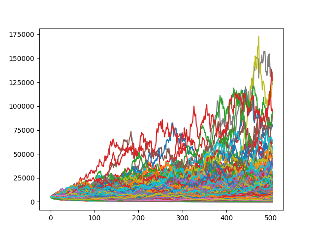

# fullmonte

<a href="https://pypi.org/project/fullmonte/">
    
</a>

Monte Carlo simulations for extrapolated returns.

## Dependencies :globe_with_meridians:

Python 3.11.6:

- [numpy 1.26.4](https://numpy.org/)
- [pandas 2.2.1](https://pandas.pydata.org/)
- [matplotlib 3.8.3](https://matplotlib.org/)

## Raison D'être :thought_balloon:

fullmonte is a python library that implements the simulation and plotting of a monte carlo run on a financial return assuming normal distributions.

## Installation :inbox_tray:

This is a python package hosted on pypi, so to install simply run the following command:

`pip install fullmonte`

## Usage example :eyes:

A quick example of how to use this library is the following:

```python
from fullmonte import simulate, plot

import pandas as pd
import numpy as np
import matplotlib.pyplot as plt

# Create some test data with a $100,000 initial investment
pct_ret = np.random.uniform(-0.1, 0.1, 252 * 10)
ret = np.concatenate((np.array([100000.0]), pct_ret + 1.0)).cumprod()
# Simulate monte carlo
df = simulate(pd.Series(ret))
print(df)
# Plot the monte carlo simulations
plot(df)
plt.show()
```

This will produce the following:



## License :memo:

The project is available under the [MIT License](LICENSE).
